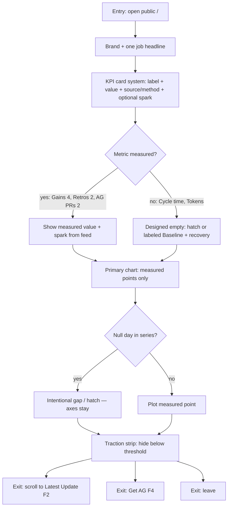
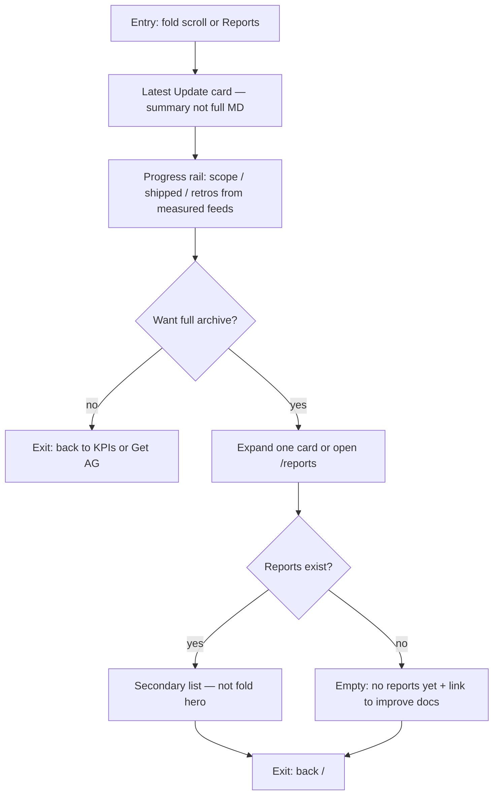
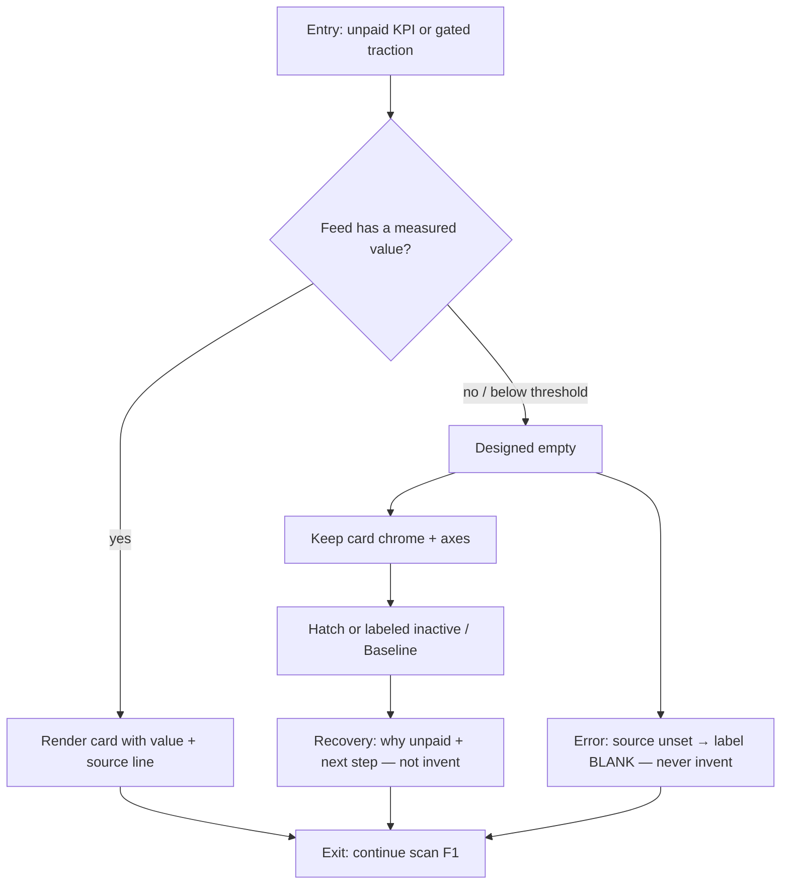
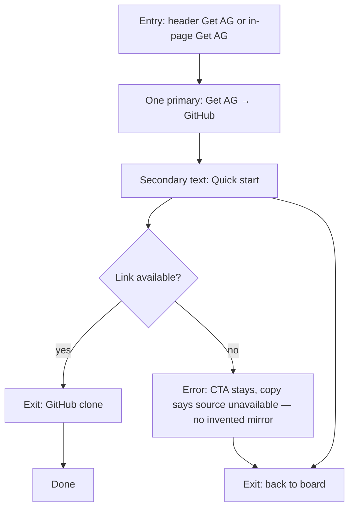
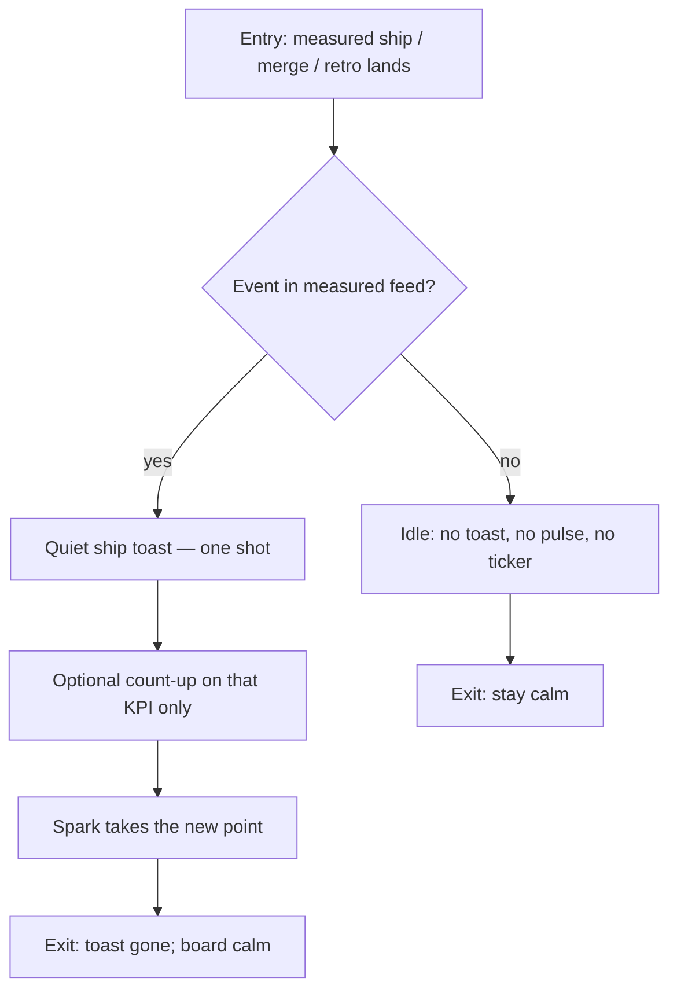

# Userflows — Public AG dashboard (`/`)

**Gate:** Critic Check 7 — Mermaid required (entry, success, error/empty, exits).
**Research SoT:** [`dashboard/docs/research/evidence.md`](../research/evidence.md) — LIVE Cos ACCEPT MERGED AG #20 @ `9721af1` on main. Adv PASS tip `b868672` (challenge), secondary.
**Jobs:** [`jtbd.md`](./jtbd.md) J1–J6.
**Chrome (Jakob):** Same primary chrome on desktop and mobile: brand, Overview, Reports, one **Get AG** primary. Mobile collapses Overview/Reports into a menu; **Get AG** stays a reserved-width header control (no clip, no wrap). Documented exception: secondary nav labels hide behind the menu at mobile — primary + brand stay visible.

Hierarchy (evidence `§8`): brand + one job headline → KPI cards → primary chart → Latest Update + Progress rail → CTA. Reports are secondary.

Measured numbers on stills (live `/` audit, not invented): Daily improve **4**, Retros **2**, AG PRs **2**, Cycle time **Baseline**, Tokens **Baseline**, chart points 2026-09-11 → 2026-09-12, traction **5 metrics gated**.

## F1 — Land & scan KPIs (J1, J2)

Entry: visitor opens `/`. Success: they trust the board and know the job. Empty: unpaid tiles use designed empty (F3). Exit: scroll to update (F2), Get AG (F4), or leave.

**Cite:** `§2` limp tiles + sparse chart; `§3` Stripe / Cloudflare / Amplitude cards, Vercel KPI→chart, Neon hatch; `§8` hierarchy; `§9` no invented numbers.

## F2 — Latest update / reports (J4)

Entry: from F1 fold or Reports nav. Success: visitor gets “what shipped” from a card + rail. Empty: no report yet → designed empty card (not a blank hole). Exit: expand one report, go `/reports`, or back to fold.

**Cite:** `§2` MD dump as hero; `§3` Linear Latest-Update + Progress rail; `§6`/`§9` collapse reports on `/`.

## F3 — Baseline / unpaid (J5)

Entry: visitor hits Cycle time or Tokens (live unpaid) or a traction-gated slot. Success: empty reads as product. Error: feed missing — BLANK / unpaid labeled, never a fake number. Exit: recovery next step or ignore and continue F1.

**Cite:** `§2` Baseline text only; `§3` Mixpanel / Amplitude recovery, Neon hatch, Stripe Radar zero; `§6` no fake fill; traction gate keep.

## F4 — Get AG (J3)

Entry: header **Get AG** or in-page CTA (same destination). Success: visitor reaches GitHub clone. Error: repo/link unavailable → supporting text, no second fake primary. Exit: GitHub, Quick start (secondary), or back.

**Hick / Fitts lock:** One primary in the thumb/header zone. No GitHub + Quick start as twin primaries. No theme toggle in the CTA cluster. Header CTA has reserved width so it does not clip or wrap (live mobile FAIL). PR “View” links are supporting, not primaries.

**Cite:** live `/` competing CTAs + clipped sticky; `§8` primary toward Get AG / GitHub; Check 8 Fitts/Hick.

## F5 — Measured ship toast (J6)

Entry: a measured ship/merge/retro is recorded in a feed. Success: one quiet toast. Empty/idle: no toast. Exit: toast dismisses; board values update only from the feed.

**Cite:** `§7` Canny / Workable / Apollo / Amplitude toast + StackAI spark; live `/` evidence of absence (no count-up/pulse/toast today); `§6` no fake ticker / invented pulse / simulated live.

## Mobile vs desktop (Jakob)

Same steps, same primary chrome. Mobile: single column; chart title does not wrap into a broken heading (live FAIL); reports stay collapsed; **Get AG** reserved in header (not clipped). Desktop nav labels may collapse — documented exception above.

## Acceptance (Check 7)

| Field | Value |
| --- | --- |
| Mermaid | F1–F5 each have entry, success, empty/error, exits |
| Map to JTBD | F1→J1/J2, F2→J4, F3→J5, F4→J3, F5→J6 |
| Research | Cited to LIVE Cos ACCEPT MERGED AG #20 @ `9721af1` evidence.md on main; Adv PASS tip `b868672` (challenge), secondary — no contradiction, no invented jobs |
| Next | Check 8 `VISUAL_STEP_STILLS` per step mobile+desktop + motion note. Stills → AG PM → Cos before Eng |
